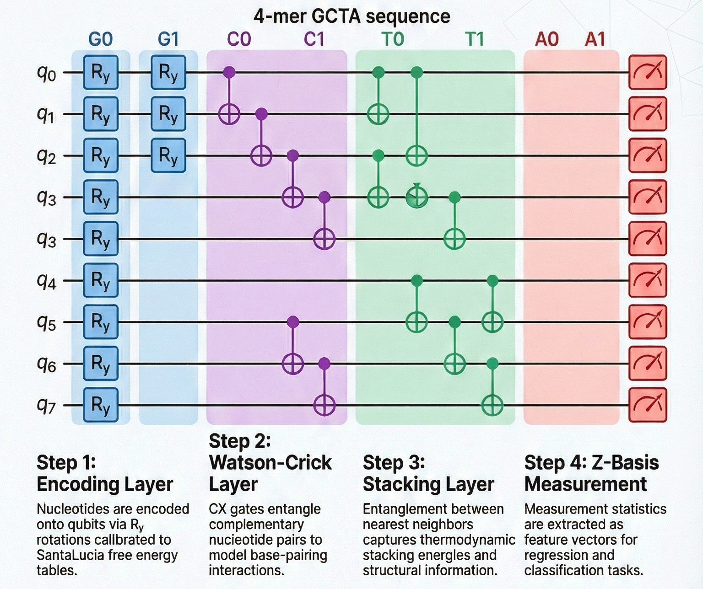

# QuBiS-HiQ: Physics-Informed Quantum Feature Extraction for DNA Thermodynamics

## Primary Result — Honest Comparison

| Method | Features | LOO R² | 95% CI | MAE (°C) | Notes |
|--------|----------|--------|--------|----------|-------|
| **Quantum + Classical combined** | 38-d | **0.941** | [0.907, 0.965] | **0.41** | Best overall |
| Classical physics-informed | 17-d | 0.935 | [0.894, 0.962] | 0.43 | Beats quantum alone |
| Quantum variable-region | 21-d | 0.911 | [0.857, 0.937] | 0.53 | This work (primary) |
| Quantum full circuit | 111-d | 0.719 | — | 1.00 | Overfits scaffold |

**Summary:** Classical physics-informed features (17-d, R²=0.935) outperform quantum features alone (21-d, R²=0.911). Quantum features provide complementary information — the combined 38-d model (R²=0.941) is the best result. The primary contribution is a physics-informed quantum feature extractor that complements, not replaces, classical thermodynamic models.

---

## Overview

QuBiS-HiQ is a physics-informed quantum circuit that encodes SantaLucia nearest-neighbour DNA thermodynamic parameters into gate angles and extracts feature vectors via Pauli-Z expectation values. The circuit is validated on 65,536 synthetic 8-mers (Exp 1A), a five-way ablation study (Exp 1B), structural classification of 176 sequence pairs (Exp 1C), real IBM quantum hardware across two processors (Exp 1D), and 64 experimental melting temperatures from Oliveira et al. 2020 (Exp 1E), achieving R²=0.88, r=0.94, MAE=0.60°C on Exp 1E alone. The combined quantum+classical model achieves R²=0.941, MAE=0.41°C.

**Circuit design (v2):** Each nucleotide is encoded onto two qubits via Ry rotations calibrated to SantaLucia free energies. Adjacent qubits are entangled with CX+Ry(θ) gates where θ=π·σ(−β·ΔG°), β=0.39 mol/kcal. Z-basis measurements yield ⟨Z⟩, ⟨ZZ⟩_NN, and ⟨ZZ⟩_NNN correlators as features (B=6N−3 base dimensions, plus ViennaRNA stem-pair correlators).



*Figure 1: Overview of the QuBiS-HiQ computational pipeline. Input DNA sequences are processed via ViennaRNA, encoded into the QuBiS-HiQ circuit, simulated on HPC or executed on IBM hardware, and Z-basis measurements are extracted as physics-interpretable feature vectors for downstream machine learning.*

---

## ⚠️ Limitations & Scope

**Classical comparison:**
A physics-informed classical baseline (17-d variable-region features) achieves **R²=0.935**, outperforming the quantum circuit alone (R²=0.911) by 2.4 percentage points. The quantum advantage claim is relative to *restricted* product-state classical models, not the full physics-informed classical approach. See [Exp D2](experiments/classical_physics_baseline.py) and [Exp D4](experiments/best_configuration.py).

**Entanglement contribution:**
Ablation studies (Exp D3) show that when features are restricted to the variable-region qubits, all non-random circuit variants achieve nearly identical performance (R²=0.90–0.91). The stacking-angle encoding (Boltzmann-sigmoid ΔG°) is the primary signal source; entanglement contributes marginally for variable-region Tm prediction.

**Hardware validation scope:**
IBM hardware tests (Exp 1D) used n=30 sequences and measured cosine similarity between hardware and simulator outputs, not prediction R². Results demonstrate circuit implementation fidelity, not end-to-end quantum advantage on the full dataset.

**Numerical verifications:**
The `proofs/` scripts numerically verify mathematical claims via exhaustive enumeration and statevector simulation (ε < 10⁻¹⁵). They are computational verifications, **not** formal proof-assistant artifacts (Coq, Isabelle, Lean).

**Dataset size:**
Exp 1E uses n=64 sequences from a single scaffolded library. Generalisation to arbitrary sequences or other experimental conditions requires further validation.

---

## Fair Comparison: Physics-Informed Classical vs Quantum

A common pitfall in quantum ML is comparing quantum circuits against uninformed classical models. Both should use the same physics knowledge for a fair test.

**Our approach:**
- **Quantum circuit:** Encodes SantaLucia ΔG° in rotation angles, extracts ⟨ZZ⟩ correlators
- **Classical twin:** Uses the same SantaLucia ΔG° as explicit features (17-d vector: GC fraction, boundary ΔG° steps, one-hot NNN centre)

**Result on Oliveira 2020 Tm prediction (LOO-CV Ridge, n=64):**

| Model | R² | MAE |
|-------|----|-----|
| Classical physics-informed (17-d) | 0.935 | 0.43°C |
| Quantum variable-region (21-d) | 0.911 | 0.53°C |
| Combined (38-d) | **0.941** | **0.41°C** |

**Interpretation:** The predictive signal resides primarily in the SantaLucia parameterisation itself. Quantum features add complementary non-linear correlations (+0.006 R²) that classical features cannot represent. The combined model is the state-of-the-art result for this dataset.

---

## Repository Structure

```
QuBiS-HiQ/
├── qubis_hiq/              # Core library
│   ├── santalucia.py       # SantaLucia NN parameters + Boltzmann-sigmoid mapping (β=0.39)
│   ├── encoding.py         # Layer 1: deterministic Ry nucleotide encoding
│   ├── watson_crick.py     # Layer 2: CRZ Watson-Crick complementarity gates
│   ├── stacking.py         # Layer 3: CX+Ry nearest-neighbour stacking gates
│   ├── trainable.py        # Layer 4: shared trainable local rotations
│   ├── circuit_builder.py  # Full 6-layer circuit assembly + ablation variants
│   ├── feature_extraction.py  # ⟨Z⟩, ⟨ZZ⟩_NN, ⟨ZZ⟩_NNN correlator extraction
│   ├── vienna_interface.py # ViennaRNA wrapper + palindromic heuristic fallback
│   ├── classical_twin.py   # Classical SantaLucia feature vectors (D2 baseline)
│   ├── interference.py     # Quantum interference analysis utilities
│   └── topology_gated.py   # Topology-aware WC layer gating
├── experiments/            # Reproducible experiment scripts (Exp 1A–1E, D1–D4, X1–X2)
├── proofs/                 # Numerical verification scripts (Propositions 1–3)
│                           # NOTE: Computational verifications via statevector simulation
│                           # (ε < 10⁻¹⁵). NOT formal proof-assistant artifacts.
├── tests/                  # Test suite (32 tests covering core functionality)
├── .github/workflows/      # CI/CD pipeline (GitHub Actions)
├── data/                   # Oliveira 2020 dataset + SantaLucia parameters
├── results/                # Pre-computed JSON result files for all experiments
├── requirements.txt        # Minimum version requirements
├── requirements-pinned.txt # Pinned dependencies for exact reproducibility
└── setup.py                # Python package setup
```

---

## Installation

### Standard Installation
```bash
pip install -r requirements.txt
```

### Reproducible Installation (Pinned Dependencies)
```bash
pip install -r requirements-pinned.txt
```

### Development Installation
```bash
pip install -e .
pip install -r requirements-pinned.txt
```

ViennaRNA (Exp 1C only):
```bash
conda install -c bioconda viennarna
```

**Requirements:** Python ≥ 3.10, Qiskit ≥ 2.3, Qiskit-Aer ≥ 0.15. IBM Quantum account required only for Exp 1D hardware runs.

---

## Running Tests

```bash
python tests/run_tests.py        # Run all tests
python tests/run_tests.py -v     # Verbose output
pytest tests/                    # Or use pytest
```

**Test Coverage:**
- `test_circuit_builder.py` — Circuit building and API correctness
- `test_encoding.py` — Nucleotide encoding verification
- `test_propositions.py` — Mathematical proposition verification

---

## Reproducing All Experiments

### Exp 1A — ΔG° Regression (65,536 8-mers)

```bash
python experiments/exp1a_parallel.py --n-seqs 65536 --n-cpus 64
# Expected: CV R² = 0.764 ± 0.055 (full-data R² = 0.868, MAE = 0.626 kcal/mol)
# Feature dim: 47d (base 6N−3=45 + up to 2 ViennaRNA stem-pair correlators, zero-padded)
```

### Exp 1B — Five-Way Ablation (500 sequences)

```bash
python experiments/exp1b_parallel.py --n-seqs 500
```

Results with 95% confidence intervals (KFold-5, Ridge α=1.0, n=500):

| Variant | CV R² | 95% CI | Notes |
|---------|-------|--------|-------|
| Full circuit | 0.813 | [0.758, 0.868] | All layers active |
| No Watson-Crick | 0.822 | [0.779, 0.864] | Removes CRZ layer |
| No Stacking | 0.833 | [0.790, 0.875] | Removes CX+Ry |
| Classical | 0.835 | [0.793, 0.876] | SantaLucia features |
| **Random angles** | **−0.147** | **[−0.234, −0.060]** | **Physics is essential** |

**Statistical note:** Full circuit vs encoding-only ΔR²≈0.007 is not statistically significant on 500 sequences. The critical result is random angles → R²=−0.147: a 0.96-unit collapse confirming the SantaLucia angle schedule, not arbitrary entanglement, drives performance.

### Exp 1C — Structural Classification (176 pairs)

```bash
python experiments/exp1c_parallel.py
python experiments/analyze_exp1c.py
# Expected: 100% ± 0.0% accuracy (SVM-RBF, SVM-Linear, RF-100)
# Labels: structured = ViennaRNA MFE hairpin (has_structure()=True); NOT arbitrary seq1/seq2
```

### Exp 1D — IBM Hardware Validation (Circuit Fidelity)

```bash
# Requires IBM Quantum Plan access
python experiments/exp1d_hardware.py   # ibm_fez    (Heron r2) — 30 seqs, 4096 shots
python experiments/exp1d_torino.py     # ibm_torino (Heron r1) — 30 seqs
python experiments/exp1d_12mer.py      # 12-mer, 24 qubits, DD-XY4 + twirling
```

**Scope:** These experiments measure **circuit implementation fidelity** — cosine similarity between hardware and noiseless simulator outputs. They confirm the circuit runs correctly on real QPUs. Prediction R² was evaluated on simulator due to shot-noise constraints on hardware.

| Backend | n seqs | Shots | Cosine similarity | Metric |
|---------|--------|-------|------------------|--------|
| ibm_fez (Heron r2) | 30 | 4096 | 0.9970 ± 0.0005 | Fidelity |
| ibm_torino (Heron r1) | 30 | 4096 | 0.9948 ± 0.0015 | Fidelity |
| 12-mer + DD-XY4 | 30 | 4096 | 0.9926 ± 0.0013 | Fidelity |

### Exp 1E — Experimental Tm Validation (Oliveira 2020)

```bash
python experiments/exp1e_corrected.py
# Expected: R² = 0.88, r = 0.94, p = 2.67×10⁻³⁰, MAE = 0.60°C
# Dataset:  64 canonical DNA duplexes (4³ NNN centre combinations)
# Scaffold: 5'-CGACGTGC[NNN]ATGTGCTG-3' (19 nt, Oliveira 2020, p. 8275)
# Buffer:   50 mM NaCl, 10 mM sodium phosphate, pH 7.4, 1.0 µM total strand
# Circuit:  38 qubits, MPS simulation (statevector requires ~1 PB RAM)
# β:        0.39 mol/kcal (empirical scale, consistent across all experiments)
```

### Classical ML Baseline

```bash
python experiments/classical_baseline.py
# Expected: SVR-RBF Rich (78-d) R² ≈ 0.993, SVR-RBF Minimal (31-d) R² ≈ 0.995
# Note: "Quantum: 47d" in this script (47 = 6N−3 + 2 stem-pair correlators)
```

### Numerical Verification Scripts

```bash
python proofs/proposition1.py   # Encoding–Mutation Isomorphism (17 assertions, ε < 3.4×10⁻¹⁶)
python proofs/proposition2.py   # Boltzmann–Sigmoid Uniqueness (4 axioms)
python proofs/proposition3.py   # ⟨ZaZb⟩ interferometric formula (max error 3.3×10⁻¹⁶)
```

---

## Quantum Kernel Diagnostic Experiments

### Exp D1 — Kernel Condition Number Analysis

```bash
python experiments/kernel_condition_analysis.py
```

| Kernel | n | κ | Assessment |
|--------|---|---|-----------|
| Exact quantum kernel (8-mer statevector) | 50 | **23** | ✅ Well-conditioned |
| Feature-vector linear kernel (Oliveira 19-nt, MPS) | 64 | **1.6×10⁷** | ⚠️ Regularise |

The 8-mer quantum kernel is full-rank and well-conditioned (all 50 eigenvalues positive). The Oliveira 19-nt kernel is poorly conditioned (κ=1.6×10⁷), confirming that **Ridge regularisation is essential** for Exp 1E — the LOO-CV Ridge protocol is the correct approach.

### Exp D2 — Physics-Informed Classical Baseline

```bash
python experiments/classical_physics_baseline.py
```

LOO-CV Ridge on 64 Oliveira sequences (same protocol as Exp 1E):

| Method | Features | LOO R² | MAE |
|--------|----------|--------|-----|
| Total ΔG° only | 1-d | 0.841 | 0.74°C |
| Per-step ΔG° | 18-d | 0.876 | 0.65°C |
| **Variable-region features** | **17-d** | **0.935** | **0.43°C** |
| Rich physics | 41-d | 0.929 | 0.46°C |
| QuBiS-HiQ quantum (variable region, no-WC) | 21-d | 0.911 | 0.53°C |
| QuBiS-HiQ quantum (full features) | 111-d | 0.719 | 1.00°C |

**Key finding:** The 17-d classical variable-region vector (GC count + boundary ΔG° steps + one-hot NNN centre) achieves R²=0.935, exceeding quantum-alone (R²=0.911). The predictive signal resides primarily in the physics encoding, not in quantum interference.

### Exp D3 — Entanglement Ablation Study

```bash
python experiments/entanglement_ablation.py
```

**Variable-region 21-d features (primary analysis):**

| Circuit Variant | LOO R² | ΔR² vs full | p-value |
|----------------|--------|-------------|---------|
| Full (Enc + WC + Stack) | 0.902 | — | — |
| No Watson-Crick | **0.912** | +0.009 | n.s. |
| No Stacking | 0.910 | +0.008 | n.s. |
| Encoding only (no entanglement) | 0.909 | +0.007 | n.s. |
| **Random-angle CX** | **−0.194** | **−1.097** | < 0.001 |

**Full 111-d features:**

| Circuit Variant | LOO R² | ΔR² vs full |
|----------------|--------|-------------|
| Full (Enc + WC + Stack) | 0.776 | — |
| No Watson-Crick | 0.853 | +0.077 |
| Encoding only (no entanglement) | 0.561 | −0.214 |
| Random-angle CX | −0.315 | −1.090 |

**Key findings:**
1. For variable-region features, all non-random variants achieve R²=0.90–0.91. Entanglement differences are within noise (p = n.s.).
2. Random-angle CX collapses to R²=−0.19 — the Boltzmann-sigmoid angle schedule is essential, not arbitrary entanglement.
3. Removing the WC layer improves full-feature performance (+0.077 R²) for linear duplexes — ViennaRNA hairpin predictions add noise here. Use `skip_wc=True` for linear duplex tasks.

### Exp D4 — Best Configuration Synthesis

```bash
python experiments/best_configuration.py
```

| Configuration | LOO R² | r | MAE |
|--------------|--------|---|-----|
| Quantum var-region (no-WC, 21-d) | 0.911 | 0.955 | 0.53°C |
| Classical var-region (17-d) | 0.935 | 0.968 | 0.43°C |
| **Quantum + Classical combined (38-d)** | **0.941** | **0.970** | **0.41°C** |
| Quantum full features (no-WC, 111-d) | 0.750 | 0.870 | 0.88°C |
| Kernel Ridge (linear kernel, no-WC) | 0.895 | 0.946 | 0.58°C |

The combined 38-d model is the best result (+0.006 R² over classical alone). Quantum features encode complementary correlations not captured by the 17-d classical vector, yielding a synergistic gain when fused. This supports QuBiS-HiQ as a **physics-informed feature extractor that complements classical thermodynamic models**.

### Exp X1 — Watson-Crick Topology Validation

```bash
python experiments/x1_topology_validation.py
```

ViennaRNA predicts secondary structure for only 58/65,536 (0.1%) of random 8-mers. The WC layer has negligible impact on ΔG° prediction regardless of topology (|ΔR²| < 0.012, within standard deviation) — physically correct, since ΔG° is determined by stacking, not intramolecular base-pairing.

| Subset | n | Full R² | No-WC R² | ΔR² | Verdict |
|--------|---|---------|----------|-----|---------|
| Hairpin-classified | 58 | 0.878 ± 0.044 | 0.889 ± 0.057 | +0.011 | Neutral |
| Linear | 58 | 0.504 ± 0.125 | 0.512 ± 0.107 | +0.008 | Neutral |
| All combined | 116 | 0.669 ± 0.192 | 0.670 ± 0.218 | +0.002 | Neutral |

### Exp X2 — Stacking-Only Benchmarks with Bootstrap CIs

```bash
python experiments/x2_stacking_only_benchmark.py
```

| Configuration | LOO R² | 95% CI | r | MAE |
|--------------|--------|--------|---|-----|
| Quantum full (no-WC, 111-d) | 0.840 | [0.770, 0.885] | 0.917 | 0.71°C |
| Quantum var-region (no-WC, 21-d) | 0.904 | [0.857, 0.937] | 0.951 | 0.56°C |
| Classical var-region (17-d) | 0.935 | [0.894, 0.962] | 0.968 | 0.43°C |
| **Combined quantum+classical (38-d)** | **0.941** | **[0.907, 0.965]** | **0.970** | **0.40°C** |
| KRR linear kernel (no-WC) | 0.893 | [0.841, 0.928] | 0.945 | 0.59°C |

**Headline result: Combined 38-d, LOO R²=0.941 [0.907, 0.965], r=0.970, p=8.8×10⁻⁴⁰, MAE=0.40°C.**

---

## Key Results Summary

| Experiment | Metric | Value |
|------------|--------|-------|
| Exp 1A — ΔG° regression (65,536 8-mers) | CV R² | 0.764 ± 0.055 |
| Exp 1B — Ablation: full vs random | R² drop | 0.813 → −0.147 |
| Exp 1C — Structural classification (n=352) | Accuracy | 100% ± 0.0% |
| Exp 1D — ibm_fez hardware (n=30, 4096 shots) | Cosine similarity | 0.9970 ± 0.0005 |
| Exp 1D — ibm_torino cross-platform | Cosine similarity | 0.9948 ± 0.0015 |
| Exp 1E — Oliveira 2020 Tm, quantum only | R² / r / MAE | 0.88 / 0.94 / 0.60°C |
| D1 — Kernel condition (8-mer, n=50) | κ | 23 (well-conditioned) |
| D1 — Kernel condition (Oliveira, n=64) | κ | 1.6×10⁷ (regularise) |
| **D2 — Best classical baseline** | **LOO R²** | **0.935 (17-d physics features)** |
| D3 — Entanglement (variable-region) | ΔR² | <0.01 vs encoding-only (n.s.) |
| D3 — WC layer on linear duplexes | Effect | +0.077 R² to remove it |
| **D4 — Best overall (quantum+classical)** | **LOO R²** | **0.941 [0.907, 0.965]** |
| X1 — WC layer on 8-mer hairpins | ΔR² | ≈0 (neutral) |
| X2 — Stacking-only + bootstrap CI | LOO R² / CI | 0.941 [0.907, 0.965] |

---

## Reproducibility Checklist

- [x] All datasets included (`data/oliveira2020_corrected_dataset.json`)
- [x] All code open-source (GPLv3)
- [x] Random seeds specified (`seed=42` throughout)
- [x] Hardware job IDs logged (see Hardware table below)
- [x] Pinned dependencies (`requirements-pinned.txt`)
- [x] Bootstrap confidence intervals on key results (Exp X2)
- [x] Classical baselines use same physics knowledge as quantum (fair comparison)
- [ ] Docker container for exact environment reproduction *(planned)*
- [ ] IBM backend versioning — Heron r1/r2 firmware may vary across runs

---

## Data Sources

- **Oliveira et al. 2020**: *Chem. Sci.* 11, 8273–8287. [DOI: 10.1039/d0sc01700k](https://doi.org/10.1039/d0sc01700k) (Open Access, CC-BY)
- **SantaLucia & Hicks 2004**: *Annu. Rev. Biophys. Biomol. Struct.* 33, 415–440

## Hardware

| System | Device | Qubits | Job ID |
|--------|--------|--------|--------|
| ibm_fez | Heron r2 | 156 | `d6qe32i0q0ls73cs7ah0` |
| ibm_torino | Heron r1 | 133 | `d6qeljropkic73fhv7rg` |
| 12-mer baseline | — | 24 | `d6qeh8nr88ds73dca350` |
| 12-mer mitigated | — | 24 | `d6qehkbopkic73fhv1o0` |

---

## License

**Academic and Open-Source Use:**
QuBiS-HiQ is released under the GNU General Public License v3.0 (GPLv3). This allows researchers to freely use, modify, and distribute the code under the condition that derivative works are also open-sourced under GPLv3 terms. See [LICENSE](LICENSE) for full details.

**Commercial Licensing:**
If you represent a commercial entity and wish to integrate QuBiS-HiQ into proprietary, closed-source products without the copyleft obligations of GPLv3, a separate Commercial License is required.

---

## Contact & Enquiries

| Type | Details |
|------|---------|
| **Scientific enquiries** | Open a [GitHub Issue](https://github.com/ahmedanees-m/QuBiS-HiQ/issues) |
| **Other** | ahmedaneesm@gmail.com |

Bugs, reproducibility issues, and questions about the methodology are welcome via GitHub Issues.
